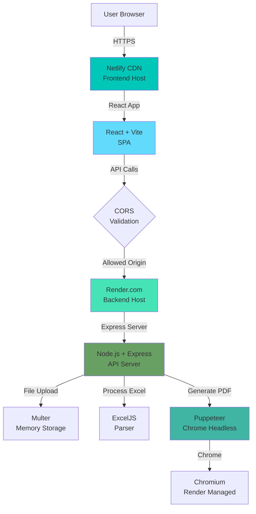
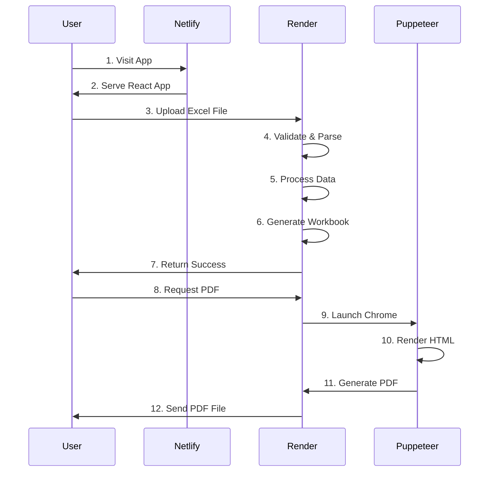
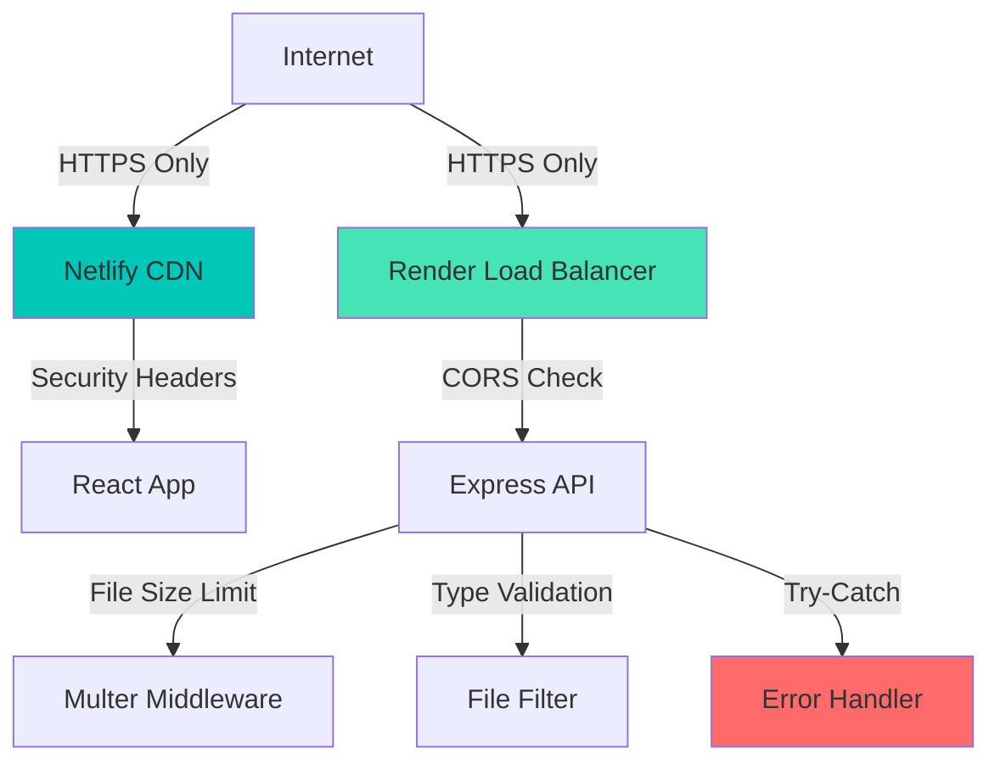
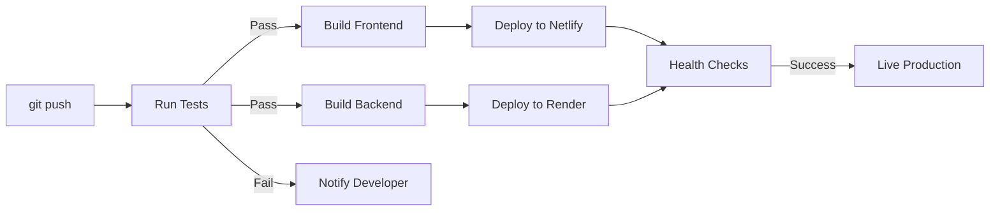
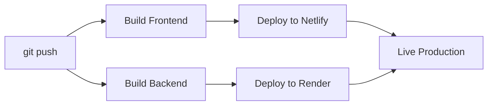

# 🏗️ Production Architecture

## System Architecture Diagram



## Data Flow



## Deployment Pipeline

```mermaid
graph LR
    Dev[Developer] -->|git push| GitHub[GitHub Repo]
    GitHub -->|Webhook| RenderDeploy[Render Auto-Deploy]
    GitHub -->|Webhook| NetlifyDeploy[Netlify Auto-Deploy]
    RenderDeploy -->|npm install| RenderBuild[Build Backend]
    RenderBuild -->|npm start| RenderLive[Live Backend]
    NetlifyDeploy -->|npm run build| NetlifyBuild[Build Frontend]
    NetlifyBuild -->|Deploy dist/| NetlifyLive[Live Frontend]
    
    style GitHub fill:#181717
    style RenderLive fill:#46E3B7
    style NetlifyLive fill:#00C7B7
```



## Tech Stack

### Frontend (Netlify)
```yaml
Framework:        React 18
Build Tool:       Vite 7
Routing:          React Router DOM 7
HTTP Client:      Axios
UI:               Tailwind CSS
Animations:       Framer Motion
File Upload:      React Dropzone
Notifications:    React Hot Toast
```

### Backend (Render)
```yaml
Runtime:          Node.js 18+
Framework:        Express 4
File Handling:    Multer
Excel:            ExcelJS
PDF:              Puppeteer 21
CORS:             cors
Config:           dotenv
```

## Environment Variables

### Backend (Render)
```bash
NODE_ENV          # production
PORT              # Auto-injected by Render
CLIENT_ORIGINS    # https://your-app.netlify.app
CHROME_PATH       # Auto-set by Render (optional)
```

### Frontend (Netlify)
```bash
VITE_API_URL      # https://your-backend.onrender.com/api
```

## API Endpoints

### Backend API Routes
```
GET  /                      # Health check (root)
GET  /api/health            # Health check (API)
POST /api/preview           # Preview Excel file
POST /api/upload            # Process Excel file
GET  /api/download/excel    # Download generated Excel
GET  /api/download/pdf      # Download generated PDF
```

## File Structure

```
NEW/
├── client/                 # Frontend (Netlify)
│   ├── src/
│   │   ├── components/    # React components
│   │   ├── services/      # API client
│   │   └── utils/         # Utilities
│   ├── public/
│   │   └── _redirects     # React Router fix
│   ├── .env               # Environment variables
│   ├── netlify.toml       # Netlify config
│   └── package.json
│
├── server/                 # Backend (Render)
│   ├── controllers/       # Request handlers
│   ├── middleware/        # Express middleware
│   ├── routes/            # API routes
│   ├── services/          # Business logic
│   ├── utils/             # Utility functions
│   ├── .env               # Environment variables
│   └── package.json
│
├── render.yaml             # Render IaC (optional)
├── DEPLOYMENT_GUIDE.md
├── DEPLOYMENT_CHECKLIST.md
└── DEPLOYMENT_SUMMARY.md
```

## Security Architecture



### Security Features
- ✅ HTTPS enforced by platforms
- ✅ CORS restricted to allowed origins
- ✅ File size limited to 10MB
- ✅ File type validation (.xlsx only)
- ✅ Memory storage (no disk writes)
- ✅ Error sanitization
- ✅ Security headers (X-Frame-Options, etc.)
- ✅ No sensitive data in code

## Performance Optimization

### Frontend
- ✅ Vite build optimization
- ✅ Code splitting
- ✅ Lazy loading
- ✅ CDN delivery
- ✅ Asset compression

### Backend
- ✅ Memory storage (fast)
- ✅ Puppeteer args optimized
- ✅ No disk I/O bottleneck
- ✅ Health checks prevent cold starts
- ✅ Efficient Excel parsing

## Scalability

### Current Limits (Free/Starter)
- **Render Free:** Sleeps after 15min, 512MB RAM
- **Render Starter:** Always on, 512MB RAM, better CPU
- **Netlify Free:** 100GB bandwidth, 300 build minutes

### Scaling Strategy
1. **Low traffic:** Free tier sufficient
2. **Medium traffic:** Render Starter ($7/month)
3. **High traffic:** Render Standard ($25/month)
4. **Enterprise:** Render Pro + Netlify Pro

## Monitoring & Observability

### Health Checks
- **Backend:** GET / (every 30s by Render)
- **Frontend:** Netlify monitoring automatic

### Logs
- **Render:** Real-time streaming logs
- **Netlify:** Build logs + function logs

### Metrics
- **Render:** CPU, Memory, Response time
- **Netlify:** Bandwidth, Build time, Deploy frequency

### Alerts
- **Render:** Email on deploy failure
- **Netlify:** Email on build failure

## Disaster Recovery

### Backup Strategy
- ✅ Code in GitHub (version controlled)
- ✅ Environment variables documented
- ✅ Configuration files in repo
- ✅ No persistent data (stateless)

### Recovery Time
- **Frontend:** 2-3 minutes (redeploy)
- **Backend:** 5-10 minutes (redeploy + Chrome install)
- **Total:** ~15 minutes max

### Rollback
```bash
# Both platforms support instant rollback
Render: Dashboard → Deploys → Rollback
Netlify: Dashboard → Deploys → Publish deploy
```

## Cost Analysis

### Development (Local)
```
Cost: $0/month
Features: Full functionality
Limitations: Local only
```

### Production (Free Tier)
```
Netlify: $0/month
  - 100GB bandwidth
  - Unlimited sites
  - Auto-deploy

Render: $0/month
  - Sleeps after 15min
  - Slower performance
  - 512MB RAM

Total: $0/month
```

### Production (Recommended)
```
Netlify: $0/month (free tier sufficient)
Render: $7/month (Starter plan)
  - Always on
  - Better CPU/RAM
  - Puppeteer works reliably

Total: $7/month
```

### Production (High Traffic)
```
Netlify: $19/month (Pro)
  - 400GB bandwidth
  - Priority support

Render: $25/month (Standard)
  - 2GB RAM
  - 2 CPU cores
  - Better performance

Total: $44/month
```

## CI/CD Pipeline

### Automated Testing (Future)


### Current Pipeline


## Browser Compatibility

### Supported Browsers
- ✅ Chrome 90+
- ✅ Firefox 88+
- ✅ Safari 14+
- ✅ Edge 90+
- ✅ Mobile browsers (iOS Safari, Chrome Mobile)

### Features
- ✅ File API (drag & drop)
- ✅ FormData (file upload)
- ✅ Fetch API (HTTP requests)
- ✅ ES6+ JavaScript
- ✅ CSS Grid & Flexbox

## Accessibility

- ✅ Semantic HTML
- ✅ ARIA labels (future enhancement)
- ✅ Keyboard navigation (future enhancement)
- ✅ Screen reader support (future enhancement)
- ✅ Responsive design

---

**Architecture designed for production reliability, scalability, and maintainability.**
