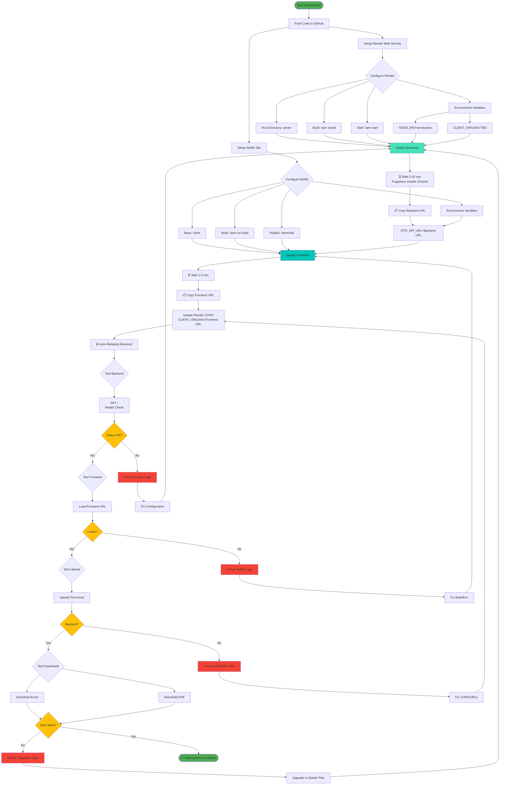
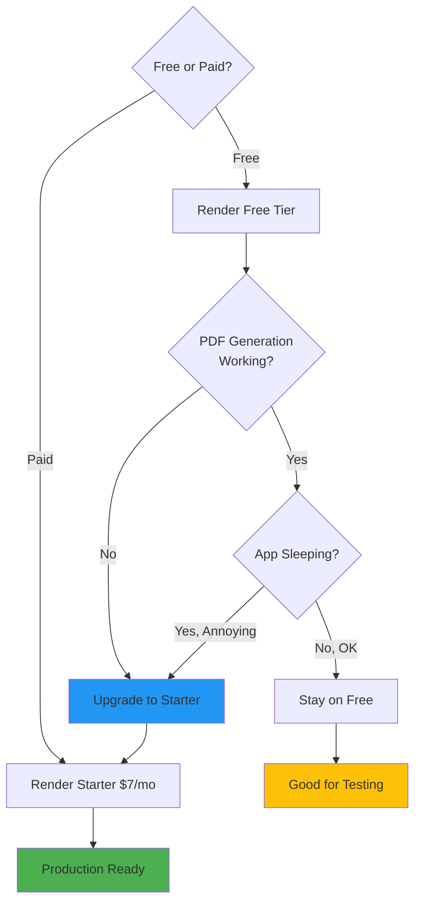
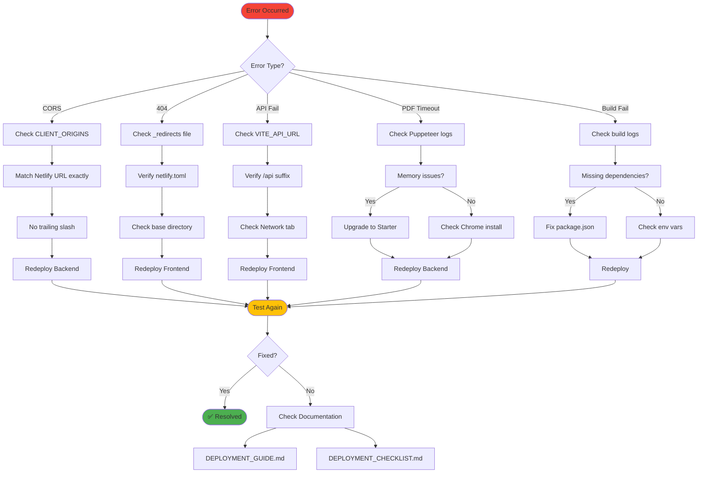
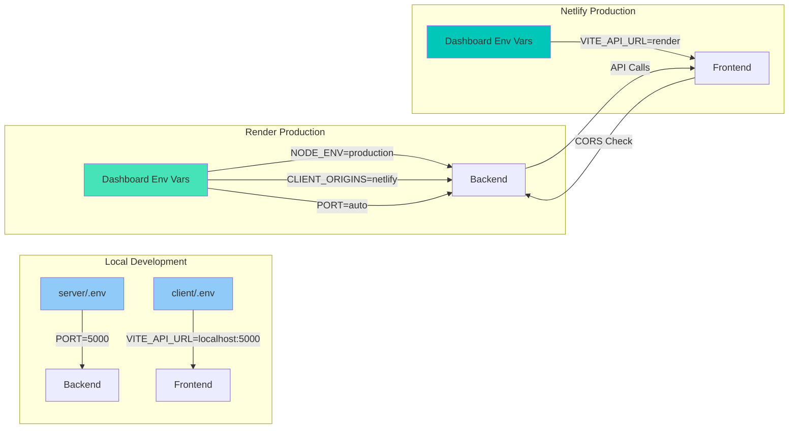

# 🗺️ DEPLOYMENT FLOWCHART

## Visual Deployment Process

---

## Deployment Timeline

```mermaid
gantt
    title Deployment Timeline (Total: ~15 minutes)
    dateFormat HH:mm
    axisFormat %M min
    
    section Render
    Configure Render           :r1, 00:00, 2m
    Deploy Backend            :r2, after r1, 8m
    Copy Backend URL          :r3, after r2, 1m
    
    section Netlify
    Configure Netlify         :n1, 00:02, 2m
    Wait for Backend URL      :n2, after n1, 7m
    Deploy Frontend           :n3, after n2, 3m
    Copy Frontend URL         :n4, after n3, 1m
    
    section CORS Update
    Update CORS Config        :c1, after n4, 1m
    Backend Redeploy          :c2, after c1, 2m
    
    section Testing
    Test Health Check         :t1, after c2, 1m
    Test File Upload          :t2, after t1, 1m
    Test Downloads            :t3, after t2, 1m
```

---

## Decision Tree

---

## Troubleshooting Decision Tree

---

## Environment Configuration Flow

---

## File Structure Impact

```mermaid
graph TD
    Root[NEW/]
    
    Root --> Server[server/]
    Root --> Client[client/]
    Root --> Docs[Documentation/]
    
    Server --> S1[server.js ✅ Modified]
    Server --> S2[package.json ✅ Modified]
    Server --> S3[.env ✅ Modified]
    
    Client --> C1[src/services/api.js ✅ Modified]
    Client --> C2[.env ✅ Modified]
    Client --> C3[public/_redirects ⭐ NEW]
    Client --> C4[netlify.toml ⭐ NEW]
    
    Docs --> D1[DEPLOYMENT_GUIDE.md ⭐ NEW]
    Docs --> D2[DEPLOYMENT_CHECKLIST.md ⭐ NEW]
    Docs --> D3[DEPLOYMENT_SUMMARY.md ⭐ NEW]
    Docs --> D4[ARCHITECTURE.md ⭐ NEW]
    Docs --> D5[FINAL_SUMMARY.md ⭐ NEW]
    Docs --> D6[README.md ⭐ NEW]
    
    Root --> R1[render.yaml ⭐ NEW]
    Root --> R2[.gitignore ⭐ NEW]
    Root --> R3[start-dev.ps1 ⭐ NEW]
    
    style S1 fill:#FFC107
    style S2 fill:#FFC107
    style S3 fill:#FFC107
    style C1 fill:#FFC107
    style C2 fill:#FFC107
    style C3 fill:#4CAF50
    style C4 fill:#4CAF50
    style D1 fill:#4CAF50
    style D2 fill:#4CAF50
    style D3 fill:#4CAF50
    style D4 fill:#4CAF50
    style D5 fill:#4CAF50
    style D6 fill:#4CAF50
    style R1 fill:#4CAF50
    style R2 fill:#4CAF50
    style R3 fill:#4CAF50
```

---

**Legend:**
- 🟢 Green: New files created
- 🟡 Yellow: Existing files modified
- ⭐ NEW: Newly created
- ✅ Modified: Updated for production

**Use these flowcharts as visual guides during deployment!**
